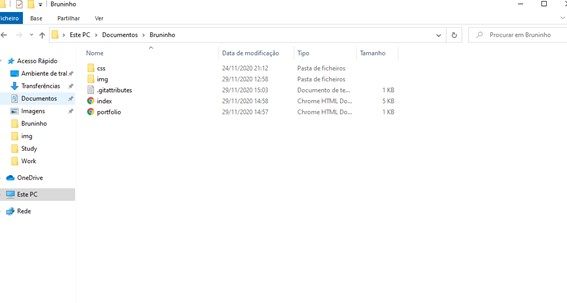
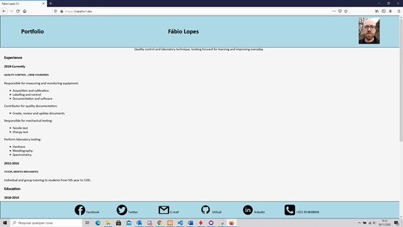
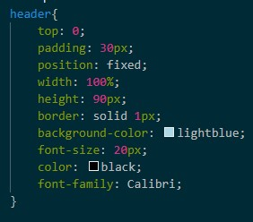
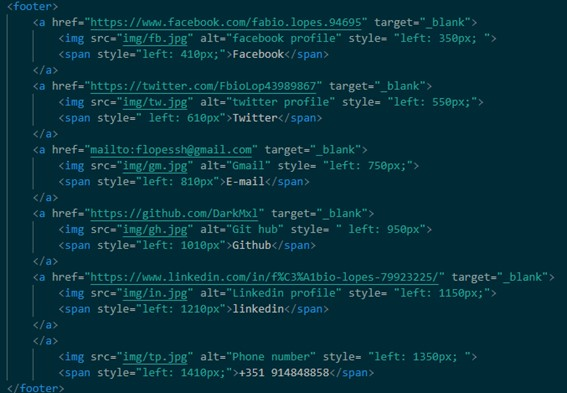
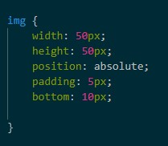
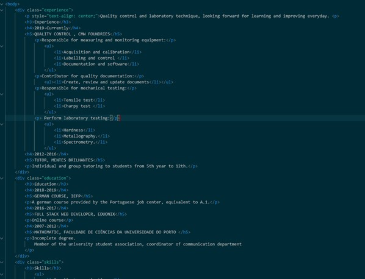
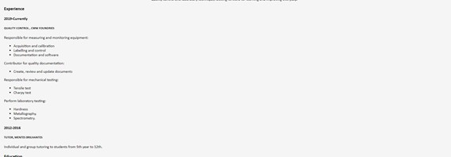

# Explaining the html/css code of the CV website

First, I create the following on the website document root:

The folder css will contain the css of our website, the folder img will contain the images of our website, the index.html is the main page and the portfolio.html is another page.
So when I start xampp and go to trabalho1.dev:

 

Now I will explain the code:
With visual code, when the file is .html I just pressed ! tab and the following appears:

 
The <head> part of the html file is the data of the document.
So i started writing the code from there, the first step was to create the css file and connect it to the html:

 
The <link> tag will connect the html to the css file, the required rel attribute specifies the relationship between the current document and the linked document/resource and the href will be the path of the file.
The title itself it what appears on the top of the browser:

 
After the <head> comes the <body>, but i created a <header> and a <footer> to be able to custom them trough css:

So, according to the assignment the header had to contain a picture of me, my name and I added the Portfolio there so who visits the site can press on it and go to my portfolio.
The  <a> tag is used for links, the href is the path of the link we want and target=_”blank” makes it open on a new page when clicked on it.
The  tag is used to import the image, the src is the path of the image, the alt is the alternative text that appears in case the image doesn’t load,  and I used css with style to put the image in the position and size I wanted.
The "h2" is the tag used for the name and portfolio, "h2" is the second biggest heading, the rest of css is used for positioning.

And the header css is the following:

 
The top: 0 puts it on the top, the position: fixed makes the header fixed when scrolling through the site, the rest is design options. 
Now the footer :

Basically, each <a> is a link to the page with the logo, clicking on the logo or on the name will open a new page with my facebook/twitter/etc.
The css is only to position the logos and the names, i used  tag because it is an inline container used to mark up a part of a text.

The css file cointains the rest of the positioning and size:

The body containts the rest of my CV:

The code is pretty simple , "h3" "h4" and "h5" are different headings sizes, the 
 is the paragraph and the "ul" is the unordered list, followed by "li" for each point on the list.
I split each section in divisions for the purpose of organization. I assigned each div a class so I could change it on css:

 
Also, it was on the assignment the hoover options, so when I hoover the text a shadow appear.
The body has margin top and bottom because the position: fixed on the header and footer would hide the first and last text of the body.
I had some difficulties regarding the position of some elements, that was for me the hardest part of this assignment. The page still needs some improvements regarding the design. 
